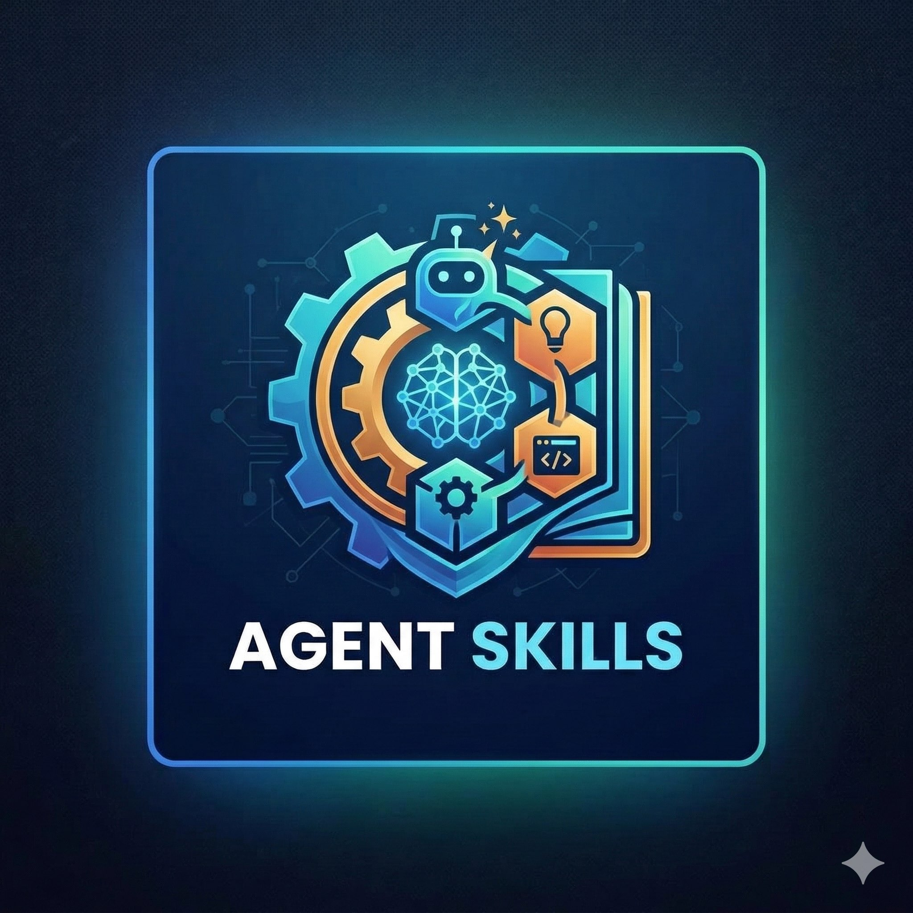

<p align="center">
  <br/>
  <a href="https://github.com/xSolutions365/skills/actions/workflows/ci-quality-gates.yml">
    
  </a>
  <a href="https://github.com/xSolutions365/skills/tree/main/skills">
    
  </a><br/>
  An opinionated approach to the www.agentskills.io standard.
</p>

# Project structure

The npx skills installer scans for `SKILL.md` files. This repo intentionally uses:

- `skills/<skill-folder>/SKILL.md`

This allows `npx skills add <repo> --list` discovers a collection of skills.

## Install examples

By default, `npx skills add` installs into the current project's `.agents/` directory. Use `-g` to install these skills at user level instead.

```bash
# List skills from this repo
npx skills add <repo-url> --list

# Install interactively at user level
npx skills add <repo-url> -g

# Install one skill only at user level
npx skills add <repo-url> --skill create-skill -g

# Install all skills to all agents at user level without prompts
npx skills add <repo-url> --all -g
```

## Quality gates

Install the Git hooks before your first commit:

```bash
pre-commit install
pre-commit install --hook-type commit-msg
```

This repo uses a centralized pre-commit and CI runner at `scripts/run-ci-quality-gates.sh`. That runner executes a custom Python linter for this repository's opinionated skill structure and enforces parity between local hooks and the GitHub Actions quality gate workflow.
It also regenerates `badges/skills-count.json` during local pre-commit runs so the skills-count badge stays in sync with the contents of `skills/`.

## Included skills

- `create-skill`
- `adaptive-prose`
- `create-execplan`
- `visual-explainer`
