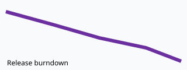
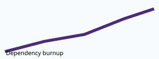

# Source-note conventions

Use ordinary Markdown. These explicit forms are deterministic and preferred; the workflow may also normalize unambiguous prose.

## Timeline events

Use a table:

```markdown
## Report timeline

| Date | Event | Type |
| --- | --- | --- |
| 2026-01-05 | SOW starts | sow-start |
| 2026-02-14 | Release 1 | release |
| 2026-06-30 | SOW ends | sow-end |
```

Or use list entries:

```markdown
- 2026-01-05 | SOW starts | sow-start
- 2026-02-14 | Release 1 | release
```

Use ISO `YYYY-MM-DD` dates. Recommended types are `sow-start`, `sow-end`, `release`, `milestone`, `launch`, `deadline`, and `phase`; other short lowercase types are allowed.

Ordinary prose such as `Release 2 launches on 2026-03-20` is eligible because the date and event are unambiguous. Ambiguous dates such as `next Friday` require the report author to resolve them from evidence before adding them.

Do not add `Today` or period-end marker rows. The presentation derives one reporting-date marker when necessary.

## Images

Use normal Markdown images. Alt text is required and the optional title becomes the preferred caption:

```markdown


```

Relative local paths resolve from the note first, then the reporting-period directory. Files must remain inside that period. Supported types are PNG, JPEG, GIF, WebP, and SVG.

Unreferenced images are discovered only in `assets/` or `images/` directories beside notes. Use descriptive filenames because their stems become fallback captions.

Remote `https://` image URLs are retained as labelled links but are not downloaded or embedded. Data URLs, absolute local paths, `file://` URLs, traversal outside the period, and unsupported formats are rejected.
